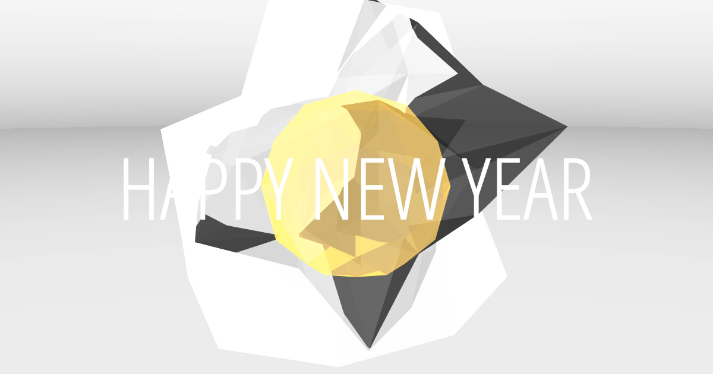

# Happy 2018

A weird-physics rhythm machine implemented as a web app using `npm`, [regl](http://regl.party/) / [glslify](https://github.com/glslify/glslify) for graphics and [Tone.js](https://tonejs.github.io/) for audio.

## Development

Everything is bootstrapped in `World`. From there, see `Physics`, `Graphics` (plus specific `regl` methods in `graphics/`), and `Audio` (plus specific sound generators in `audio/`).

`regl` provides the `requestAnimationFrame` hook, which then steps the animation in `Physics`, draws in `Graphics`, and modulates audio parameters in `Audio`.

Messages are specified in `index.html` and triggered by `Messages`.

That's about it. Keep on tappin'!

### Installation

    npm i
    npm i -g webpack-dev-server

### Running (development)

    npm start

Then point your browser to `http://localhost:8080/`.

### Building (production)

    npm run-script build

App will be built to `build/`. (Currently deployed via [Netlify](https://www.netlify.com/).)
